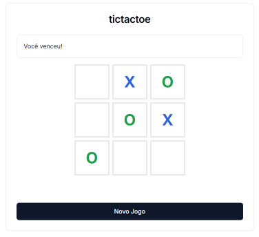

# Tic Tac Toe com Q-Learning



## Índice

1. [Processo de Decisão de Markov (MDP)](#processo-de-decisão-de-markov)
2. [Q-Learning](#q-learning)
3. [Exploração vs Exploitação](#exploração-vs-exploitação)
4. [Função de Valor e Equação de Bellman](#função-de-valor-e-equação-de-bellman)
5. [Implementação no Jogo da Velha](#implementação-no-jogo-da-velha)
6. [Análise de Convergência](#análise-de-convergência)

## Processo de Decisão de Markov

### Definição Formal
Um MDP é definido como uma tupla (S, A, P, R, γ), onde:
- S: conjunto de estados
- A: conjunto de ações
- P: função de probabilidade de transição
- R: função de recompensa
- γ: fator de desconto

### Aplicação no Jogo da Velha
No nosso caso:
- S: todas as possíveis configurações do tabuleiro 3x3 (3⁹ estados possíveis)
- A: posições vazias onde é possível jogar
- P: determinística (cada ação leva a um único próximo estado)
- R: {-1 (derrota), 0 (empate/jogo em andamento), 1 (vitória)}
- γ: 0.9 (valoriza recompensas futuras)

```python
# Representação do estado no código
board = np.zeros((3, 3), dtype=int)
# 0: vazio
# 1: X (agente)
# -1: O (oponente)
```

## Q-Learning

### Algoritmo Base
O Q-Learning atualiza os valores Q usando a fórmula:

Q(s,a) ← Q(s,a) + α[R + γ max Q(s',a') - Q(s,a)]

Onde:
- Q(s,a): valor da ação a no estado s
- α: taxa de aprendizado
- R: recompensa imediata
- γ: fator de desconto
- max Q(s',a'): máximo valor Q possível no próximo estado

```python
# Implementação da atualização Q
def update(self, state, action, reward, next_state, next_valid_moves):
    state_key = self._get_state_key(state)
    action_key = str(action)
    next_state_key = self._get_state_key(next_state)
    
    next_max_value = max([self.q_table[next_state_key][str(move)] 
                         for move in next_valid_moves]) if next_valid_moves else 0
    
    current_q = self.q_table[state_key][action_key]
    self.q_table[state_key][action_key] = current_q + self.alpha * (
        reward + self.gamma * next_max_value - current_q
    )
```

### Estrutura da Q-Table
- Chave: string representando o estado do tabuleiro
- Valor: dicionário mapeando ações para valores Q
- Inicialização: valores zero para todas as entradas

## Exploração vs Exploitação

### Política ε-greedy
Balanceia exploração e exploitação usando probabilidade ε:
- Com probabilidade ε: escolhe ação aleatória (exploração)
- Com probabilidade (1-ε): escolhe melhor ação conhecida (exploitação)

```python
def get_action(self, state, valid_moves):
    if random.random() < self.epsilon:  # Exploração
        return random.choice(valid_moves)
    return self._get_best_action(state, valid_moves)  # Exploitação
```

### Análise Matemática
Probabilidade de explorar decresce com o tempo:
P(explorar) = ε
P(exploitar) = 1 - ε

## Função de Valor e Equação de Bellman

### Função Valor-Estado (V)
V(s) = max_a Q(s,a)

Representa o valor esperado de longo prazo começando no estado s.

### Função Valor-Ação (Q)
Q(s,a) = R(s,a) + γ Σ P(s'|s,a) max_a' Q(s',a')

No nosso caso determinístico:
Q(s,a) = R(s,a) + γ max_a' Q(s',a')

### Equação de Bellman
A equação de Bellman estabelece a relação recursiva entre valores de estados:
V(s) = max_a [R(s,a) + γ Σ P(s'|s,a)V(s')]

## Implementação no Jogo da Velha

### Estado do Jogo
O estado é codificado como uma matriz 3x3:
```python
[[0,  1, -1],
 [0,  0,  1],
 [-1, 0,  0]]
```

### Recompensas
- Vitória (agente ganha): +1
- Derrota (oponente ganha): -1
- Empate/Em andamento: 0

```python
if self._check_winner() == self.current_player:
    reward = 1
    done = True
elif self._check_winner() is not None:
    reward = -1
    done = True
elif len(self.get_valid_moves()) == 0:
    done = True
    reward = 0
```

### Função de Transição
A transição de estados é determinística:
P(s'|s,a) = 1 para o próximo estado resultante da ação
P(s'|s,a) = 0 para todos os outros estados

## Análise de Convergência

### Teorema de Convergência do Q-Learning
O Q-Learning converge para a política ótima sob as seguintes condições:
1. Todos os pares estado-ação são visitados infinitamente
2. A taxa de aprendizado decresce apropriadamente
3. A política de exploração garante exploração suficiente

### Taxa de Convergência
- Depende do valor de α (taxa de aprendizado)
- Influenciada pelo valor de γ (fator de desconto)
- Impactada pela política de exploração (ε)

### Métricas de Performance
1. Taxa de Vitória
```python
win_rate = wins / total_games
```

2. Convergência dos Valores Q
```python
q_value_change = |Q_new(s,a) - Q_old(s,a)|
```

3. Entropia da Política
```python
policy_entropy = -Σ π(a|s) log π(a|s)
```

## Considerações Práticas

### Hiperparâmetros
- α = 0.1 (taxa de aprendizado)
  - Pequeno o suficiente para convergência estável
  - Grande o suficiente para aprendizado efetivo
- γ = 0.9 (fator de desconto)
  - Balanceia recompensas imediatas e futuras
- ε = 0.1 (taxa de exploração)
  - Permite exploração suficiente
  - Mantém exploitação dominante

### Otimizações
1. Armazenamento Eficiente
```python
self.q_table = defaultdict(lambda: defaultdict(float))
```

2. Simetrias do Tabuleiro
- Rotações e reflexões reduzem espaço de estados
- 8 configurações equivalentes por estado

### Trade-offs
1. Velocidade vs Precisão
- Maior γ → Aprendizado mais preciso, mas mais lento
- Menor α → Convergência mais estável, mas mais lenta

2. Exploração vs Exploitação
- Maior ε → Mais exploração, menos performance imediata
- Menor ε → Melhor performance imediata, risco de mínimo local

## Visualização do Aprendizado

### Gráfico de Convergência
```python
plt.figure(figsize=(10, 6))
plt.plot(range(len(win_rates)), win_rates, 'b-')
plt.xlabel('Episódios (x100)')
plt.ylabel('Taxa de Vitória')
plt.title('Progresso do Treinamento do Agente')
plt.grid(True)
plt.show()
```

### Matriz de Valor
Visualização dos valores Q para cada posição:
```
Estado Atual:
[[ 0.8  0.4  0.6]
 [ 0.3  0.9  0.2]
 [ 0.5  0.7  0.4]]
```